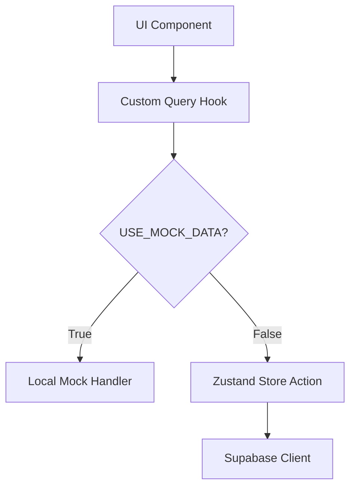

Here's a clear separation strategy for your mock/Supabase setup using both libraries effectively:

### **Architecture Blueprint**



### **1. Zustand Responsibilities**
- **Store Design**
  ```ts
  interface ApiStore {
    // Supabase operations
    fetchData: () => Promise<Data>
    postData: (payload: Data) => Promise<void>
    
    // Client-side control
    useMock: boolean
    setUseMock: (value: boolean) => void
  }
  ```
  
- **Core Duties**
  - Manage the mock toggle state
  - Contain all Supabase client operations
  - Store API configuration (endpoints, headers)
  - Handle encryption/decryption if needed

### **2. TanStack Query Responsibilities**
- **Query/Mutation Setup**
  ```ts
  // Query example
  useQuery({
    queryKey: ['data', filters],
    queryFn: () => 
      useStore.getState().useMock 
        ? mockFetch(filters)
        : useStore.getState().fetchData(filters)
  })

  // Mutation example  
  useMutation({
    mutationFn: (payload) =>
      useStore.getState().useMock
        ? mockPost(payload)
        : useStore.getState().postData(payload)
  })
  ```
  
- **Core Duties**
  - Manage request caching/revalidation
  - Handle loading/error states
  - Retry failed requests
  - Optimistic updates

### **3. Operation Flow Breakdown**

| **Operation**         | **Mock Path**                | **Supabase Path**               |
|-----------------------|------------------------------|----------------------------------|
| **Data Fetching**     | Local JSON/JS object         | Zustand → Supabase client       |
| **Data Mutation**     | Local state simulation       | Zustand → Supabase transaction  |
| **Error Handling**    | Manual error simulation      | Automatic Supabase error parsing|
| **Caching**           | Cache disabled/infinite      | Smart cache invalidation        |

### **4. File Structure Recommendation**

```
/src
├─ /utils
│  ├─ mockItinerary.ts    # Mock data and simulation logic
│  └─ supabaseClient.ts  # Supabase initialization
│
├─ /stores
│  └─ tripStore.ts        # Zustand store with operations
│
├─ /hooks
│  └─ destinationQueries.ts     # Custom query hooks
```

### **5. Key Integration Points**

1. **Single Source of Truth**
   - Zustand stores the mock flag but doesn't handle caching
   - TanStack Query accesses the flag via `usetripStore.getState()`

2. **Mock Implementation**
   ```ts
   // mockHandlers.ts
   export const mockFetch = async () => {
     await sleep(500) // Simulate network delay
     return structuredClone(mockDataset) // Prevent reference issues
   }
   ```

3. **Supabase Implementation**
   ```ts
   // tripStore.ts
   fetchData: async () => {
     const { data, error } = await supabase
       .from('table')
       .select('*')
       
     if (error) throw new ErrorHandler(error)
     return data
   }
   ```

### **6. Switching Mechanism**

```ts
// hooks/destinationQueries.ts
export const useSmartQuery = (queryKey: QueryKey) => {
  const { useMock, fetchData } = usetripStore()
  
  return useQuery({
    queryKey,
    queryFn: () => useMock ? mockFetch() : fetchData(),
    staleTime: useMock ? Infinity : 60_000
  })
}
```

### **7. Benefits of This Split**

1. **Clear Separation**
   - Zustand = Business logic/connection management
   - TanStack = Data lifecycle management

2. **Safe Transition**
   - Switch data sources without touching components
   - Compare real/mock behavior instantly

3. **Unified Interface**
   - Components use same hooks regardless of data source
   - Error handling pattern consistency

4. **Optimized Performance**
   - Real data: Automatic background refresh
   - Mock data: No unnecessary network calls


I'll help you restructure the code following the separation strategy. Here's the optimized implementation:

```typescript
// utils/mockItinerary.ts
export const mockItineraries: TripItinerary[] = [...]; // Your mock data
export const emptyItinerary: TripItinerary = {...};

export const mockAPI = {
  fetchDestinations: async (category?: string) => {
    await new Promise(resolve => setTimeout(resolve, 500));
    return mockItineraries.filter(i => i.is_public && (
      category === 'all' || i.tags.includes(category)
    ));
  },
  // Add similar mock implementations for all operations
};
```

```typescript
// stores/tripStore.ts
import { create } from 'zustand';
import { supabase } from '@/utils/supabaseClient';
import { TripItinerary, TripDay, TripActivity } from '@/types/destinations';

interface TripStore {
  // State
  currentItinerary: TripItinerary | null;
  userItineraries: TripItinerary[];
  sharedItineraries: TripItinerary[];
  favorites: string[];
  
  // Supabase Operations
  supabaseFetchDestinations: (category?: string) => Promise<TripItinerary[]>;
  supabaseFetchItinerary: (id: string) => Promise<TripItinerary | null>;
  supabaseCreateItinerary: (itinerary: Omit<TripItinerary, 'id'>) => Promise<TripItinerary>;
  // Add all other Supabase operations...
}

export const useTripStore = create<TripStore>((set) => ({
  currentItinerary: null,
  userItineraries: [],
  sharedItineraries: [],
  favorites: [],

  supabaseFetchDestinations: async (category) => {
    const { data, error } = await supabase
      .from('trip_itineraries')
      .select('*')
      .eq('is_public', true)
      .ilike('category', `%${category}%`);

    return data as TripItinerary[];
  },

  supabaseFetchItinerary: async (id) => {
    const { data, error } = await supabase
      .from('trip_itineraries')
      .select('*')
      .eq('id', id)
      .single();

    return data as TripItinerary;
  },

  supabaseCreateItinerary: async (itinerary) => {
    const { data, error } = await supabase
      .from('trip_itineraries')
      .insert(itinerary)
      .select()
      .single();

    return data as TripItinerary;
  },
  // Implement all other Supabase operations...
}));
```

```typescript
// hooks/destinationQueries.ts
import { useQuery, useMutation, useQueryClient } from '@tanstack/react-query';
import { USE_MOCK_DATA } from '@/config';
import { mockAPI } from '@/utils/mockItinerary';
import { useTripStore } from '@/stores/tripStore';

export const tripKeys = { /*...*/ };

// Generic query handler
const queryHandler = async <T>({
  mockFn,
  supabaseFn
}: {
  mockFn: () => Promise<T>,
  supabaseFn: () => Promise<T>
}) => {
  return USE_MOCK_DATA ? mockFn() : supabaseFn();
};

// Fetch destinations
export const useDestinations = (category?: string) => {
  const store = useTripStore();
  
  return useQuery({
    queryKey: tripKeys.list(category),
    queryFn: () => queryHandler({
      mockFn: () => mockAPI.fetchDestinations(category),
      supabaseFn: () => store.supabaseFetchDestinations(category)
    })
  });
};

// Create itinerary
export const useCreateItinerary = () => {
  const store = useTripStore();
  const queryClient = useQueryClient();

  return useMutation({
    mutationFn: (newItinerary: Omit<TripItinerary, 'id'>) => queryHandler({
      mockFn: () => mockAPI.createItinerary(newItinerary),
      supabaseFn: () => store.supabaseCreateItinerary(newItinerary)
    }),
    onSuccess: () => {
      queryClient.invalidateQueries(tripKeys.all);
    }
  });
};

// Fetch single itinerary
export const useItinerary = (id: string) => {
  const store = useTripStore();

  return useQuery({
    queryKey: tripKeys.detail(id),
    queryFn: () => queryHandler({
      mockFn: () => mockAPI.fetchItinerary(id),
      supabaseFn: () => store.supabaseFetchItinerary(id)
    }),
    enabled: !!id
  });
};

// Similar pattern for all other operations...
```

```typescript
// config.ts
export const USE_MOCK_DATA = import.meta.env.MODE === 'development';
```

This structure provides:

1. Clear separation of concerns:
- Zustand (tripStore.ts) handles only Supabase operations and client state
- TanStack Query (destinationQueries.ts) handles data fetching/caching
- Mock data lives in separate files

2. Centralized mock control:
- Single `USE_MOCK_DATA` flag controls all operations
- Mock and real implementations have identical interfaces
- Switching requires no component changes

3. Optimized performance:
- TanStack handles caching/refetching
- Zustand manages UI-related state
- Mock data includes simulated network delays

4. Type safety:
- Consistent types across mock and real implementations
- TypeScript generics in query handler
- Shared type definitions

5. Scalability:
- Add new operations with same pattern
- Easy to extend mock data
- Clear file organization

To use this pattern:

```tsx
// Component usage example
const Component = () => {
  const { data, isLoading } = useDestinations('adventure');
  const createMutation = useCreateItinerary();

  // Render logic...
};
```

This architecture provides a maintainable foundation for both development and production while keeping the benefits of both Zustand and TanStack Query.